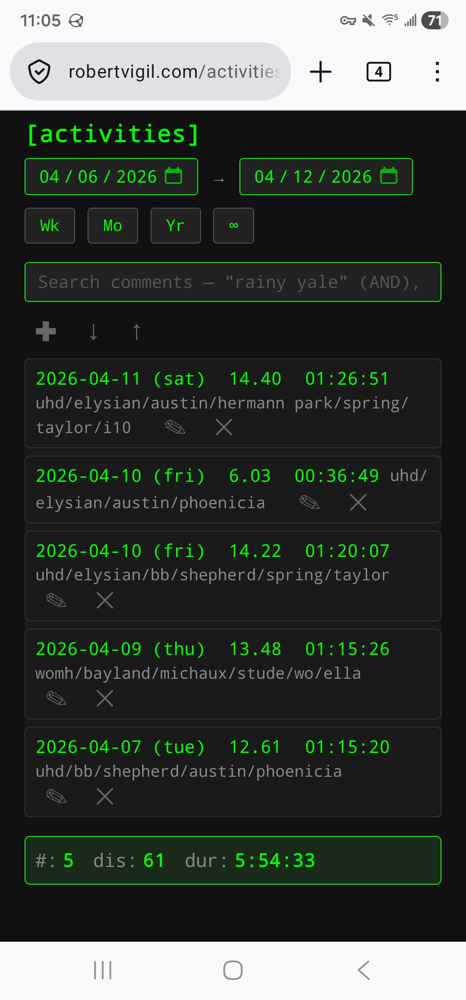
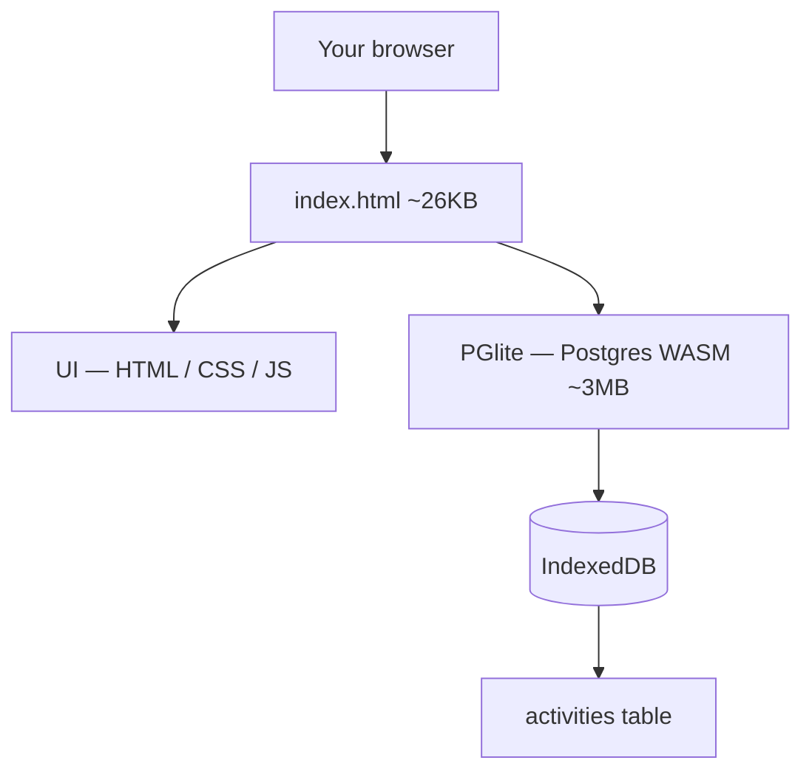

# pglite-activities

A minimalist activity tracker that runs **entirely in your browser**. No backend, no accounts, no cloud — just a single HTML file with a real PostgreSQL database (via [PGlite](https://pglite.dev/)) running client-side in IndexedDB.

Built for logging distance-based exercises (biking, running, walking) but the schema adapts to anything with a date, a distance, a duration, and notes.

**Live demo:** [robertvigil.com/activities](https://robertvigil.com/activities)



## How it works

A single HTML file loaded in your browser. Activities live in the browser's IndexedDB via PGlite. To move data between devices, export a CSV and share it however you want (I use [Syncthing](https://syncthing.net/)).

## Features

- **Date range filtering** — always-active `from → to` range with quick buttons (Wk / Mo / Yr / ∞). Range persists in localStorage.
- **Live totals** — count, total distance, total duration — computed by the database, not JavaScript
- **Comments search** — multi-word AND with exclusion: `yale -rain` matches comments containing "yale" but not "rain"
- **Smart list/summary display** — ≤30 rows shows individual activities, >30 rows shows totals only (prevents wall-of-text for wide date ranges)
- **Inline CRUD** — add, edit, delete activities with compact icon buttons (✚ ✎ ✕ ✓ ↺)
- **CSV import/export** — round-trip activities to a CSV file. Import has built-in deduplication via a unique constraint on `(date, distance, duration, comments)`, so re-importing the same CSV is a no-op
- **Keyboard-friendly** — Esc cancels create/edit, Enter submits forms
- **Mobile responsive** — compact cards on small screens, tables on desktop
- **Retro terminal aesthetic** — green-on-black monochrome theme

## Architecture



- **No backend.** The server only delivers `index.html` (static file).
- **No network.** Once loaded, the app works offline. Everything happens client-side.
- **Real SQL.** Not simulated — PGlite is actual PostgreSQL compiled to WebAssembly. Same query engine, same SQL features (window functions, CTEs, JSONB, pgvector, etc.) as a full Postgres server.

## Schema

```sql
CREATE TABLE activities (
  id SERIAL PRIMARY KEY,
  date DATE NOT NULL,
  distance NUMERIC(10, 2) NOT NULL,
  duration INTERVAL NOT NULL,   -- real Postgres interval type
  comments TEXT DEFAULT '',
  UNIQUE (date, distance, duration, comments)
);
```

- `INTERVAL` type means duration math is native (`SUM(duration)` just works)
- The `UNIQUE` constraint is what makes CSV re-imports idempotent via `INSERT ... ON CONFLICT DO NOTHING`

## Running it

### Local: serve via any static file server

PGlite loads as an ES module from a CDN, which browsers block over `file://` — so you need a web server. Any static one works:

```bash
# Python stdlib (no dependencies)
python3 -m http.server 8766
```

Then open `http://localhost:8766/`.

### Deploy to a real server

It's one HTML file. Drop it behind any web server — nginx, Caddy, Vercel, GitHub Pages, etc.

## Import / Export

**Export CSV** (↓ button): downloads `activities-YYYY-MM-DD.csv` with all rows in a standard CSV format (date, distance, duration, comments).

**Import CSV** (↑ button): reads a CSV file and inserts rows in a transaction. Duplicate rows (same date + distance + duration + comments) are silently skipped thanks to the `UNIQUE` constraint. After import you get a summary:

```
Attempted: 893
Imported: 238
Skipped (duplicates): 655
```

This makes the import workflow idempotent — you can re-import the same CSV as often as you want without creating duplicates.

## Syncing between devices

There's no built-in sync. The recommended workflow is:

1. Export CSV on device A
2. Move the CSV file to device B (Syncthing, email, USB, whatever)
3. Import CSV on device B

The deduplication means you can import "everything" every time without worrying about creating dups. Set up a Syncthing folder between your devices, drop your exports there, and import on whichever device needs updating.

For automatic sync between a browser-based PGlite database and a real Postgres server, look into [ElectricSQL](https://electric-sql.com/) — same team that makes PGlite.

## Data privacy

- Activity data lives **only** in your browser's IndexedDB
- Nothing is sent to any server
- Other visitors to the same URL get their own empty database — they can't see your rides
- If you deploy the site publicly, strangers who visit just get a blank app in their own browser
- The only thing that leaves your browser is what you choose to export via CSV

**Backup is your responsibility.** If you clear site data, lose your browser profile, or uninstall the browser without a recent CSV export, your rides are gone. Regular exports to an external location (Syncthing, Dropbox, etc.) are the backup strategy.

## Keyboard shortcuts

- **Enter** — submit create/edit form
- **Esc** — cancel current create/edit
- **Tab** — navigate form fields

## Browser support

Needs a modern browser with:
- ES modules
- IndexedDB (all browsers)
- `:has()` CSS selector (2023+)
- WebAssembly (all modern browsers)

Tested: Firefox, Chrome, Safari (desktop + mobile).

## License

MIT — see `LICENSE`.

---

*This project was vibe-coded with [Claude Code](https://claude.ai/claude-code).*
